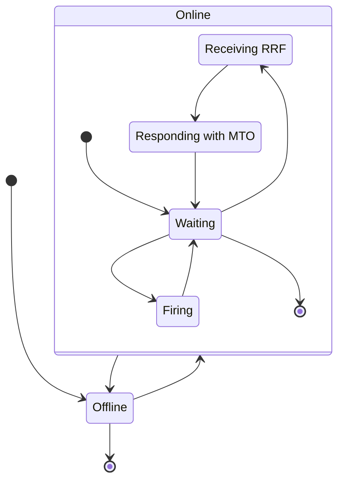
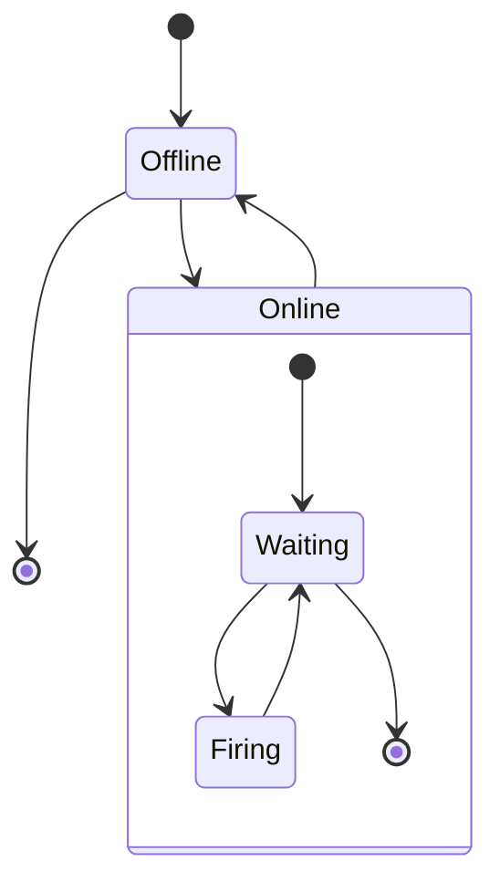
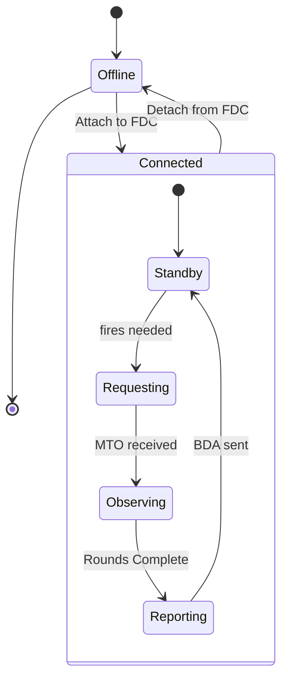
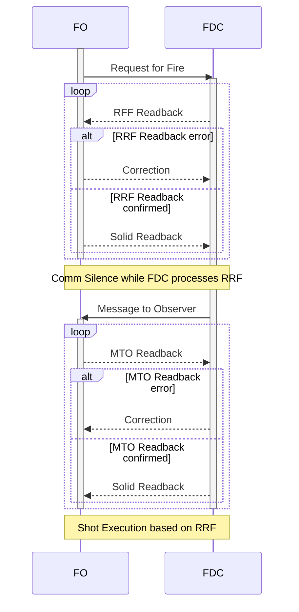
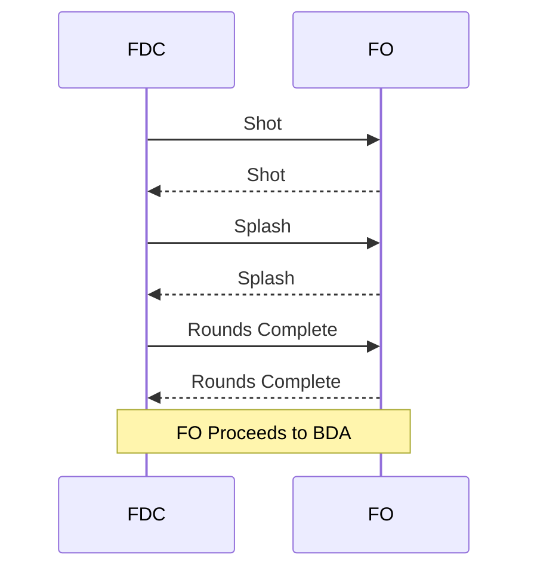
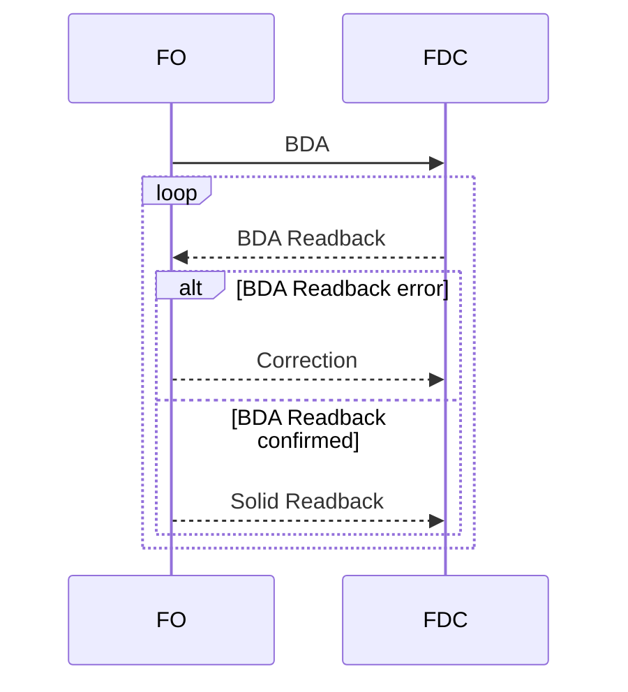

# Example-Simulators for Rust

Example of Simulators written in Rust. Each workspace member is either a binary crate representing a different simulator, or a library crate for shared behavior. These simulators will try to emulate an FO-FDC-Gun chain, using a variety of interfaces. Key features to be explored with this: Serialization/Deserialization with `serde`, asynchronous IO with `tokio`, compartmental unit tests and integration tests.

## Roadmap

- [x] FO - FDC Message Definitions
- [x] FDC - Gun Message Definitions
- [x] FO States
- [x] FDC States
- [ ] Gun States
- [x] FO - FDC Integration
- [ ] FDC - Gun Integration
- [ ] Full System Integration
- [ ] External Factor Control Message Definitions

## Simulators

The simulators provided are designed to interop with each other, as defined by each simulator.

### Fire Direction Controller Sim

This sim emulates the FDC operator. Each FDC sim will own and communicate with multiple Gun sims.
The FDC state machine is as follows:



### Gun Sim

This sim emulates a gun being directed by the FDC. Each gun can only process one mission at a time.



### Forward Observer Sim

This sim emulates a Forward Observer, who sends requests to the FDC for a fire mission.



## Interfaces

### FDC - Gun Interface

The FDC interacts with each Gun via a TCP interface. The FDC acts as a TCP Server, and each gun will attempt to register with their connected FDC on the listening socket.

The interface is a simple message header stream. Unless otherwise specified, each table represents the data in order from beginning to end. Each message will contain a header indicating the size of the message to follow:

| Message Field | Description | Size |
| --- | --- | --- |
| Header | Number of bytes that the message contains | 4 bytes |
| Message ID | ID Specific to each message type | 1 bytes |
| Message | Message contents | variable |

The message field can contain the following possible messages:

| MessageType | Message ID | Length | Description |
| --- | --- | --- | --- |
| ComplianceResponse | 0x00 | 1 byte | Response message for Fire and CheckFire |
| FireReport | 0x01 | | A report that rounds have been fired, as well as the time until on-target |
| StatusRequest | 0x02 | 0 bytes | Requests a status from the Gun |
| StatusReply | 0x03 | variable | The reply to a StatusRequest |
| Reserved | 0x04 | N\A | N\A |
| FireCommand | 0x05 | 13 bytes | Request the Gun to fire at the specified target, with specified ammunition |
| CheckFire | 0x06 | 0 bytes | Requests the Gun to checkfire a current fire mission |
| Reserved | 0x07 - 0xFF | N\A | N\A |

#### Compliance Response

A Compliance Response is sent from a Gun in response to a Fire Command or Check Fire message from the FDC. The message is a single byte.

| Compliance | Value | Description |
| --- | --- | --- |
| CANTCO | 0x01 | The Gun cannot comply with the received message |
| WILLCO | 0x02 | The Gun will comply with the received message |
| HAVECO | 0x03 | The Gun has already complied to this message |

#### Fire Report

A report of fires from a gun. Each fire will send a Fire Report, most importantly with a time-to-target field.

| Field | Size | Representation |
| --- | --- | --- |
| Shot Number | 1 byte | unsigned 8-bit integer |
| Total Shots | 1 byte | unsigned 8-bit integer |
| Ammunition | 1 bytes | enumeration |
| Target Location | 8 bytes | submessage |
| Time-To-Target | 4 bytes | unsigned 32-bit integer in milliseconds |

#### Status Request

A request for a Status Reply from a Gun.
This message is unique, as it contains a 0-length message.

#### Status Reply

A reply to a Status Request, sent from a Gun.

| Field |Size | Representation |
| --- | --- | --- |
| Status | 1 byte | enumeration |
| Ammunition Status | 5 x n bytes | n submessages |

##### Status Enumeration

| Status | Value |
| --- | --- |
| Non-operational | 0x00 |
| Partial Operational | 0x01 |
| Fully Operational | 0x02 |

##### Ammunition Status

A map of ammunition to count, as 5-byte blocks.

| Field | Size | Representation |
| --- | --- | --- |
| Ammunition | 1 byte | enumeration |
| Count | 4 bytes | unsigned 32-bit integer (big-endian) |

###### Ammunition Enumeration

| Ammunition | Value |
| --- | --- |
| High Explosive | 0x00 |

#### Fire Command

A Fire Command originates from an FDC, and tells a specific gun the target for fires, the ammunition for use, and how many rounds to fire.

| Field | Size | Representation |
| --- | --- | --- |
| Rounds | 4 bytes | unsigned 32-bit integer (big-endian) |
| Ammunition | 1 byte | enumeration |
| Target Location | 8 bytes | submessage |

##### Target Location

A target location for a gun is a range in meters and a direction in mils

| Field | Size | Representation |
| --- | --- | --- |
| Range | 4 bytes | unsigned 32-bit integer in meters |
| Direction | 4 bytes | unsigned 32-bit integer in mils |

#### Check Fire

A Check Fire originates from an FDC, and tells a specific gun to stop all fires. A Compliance Reponse is expected from the Gun after receipt of a Check Fire.

A Check Fire is a 0-byte message. Only the header is provided.

### FO - FDC Interface

The Forward observer will provide requests to the FDC to process fire missions. Multiple fire missions can be queued with an FDC, but each mission is not completed until the FO confirms the mission is complete, or the FDC informs a CANTCO.

The FO will communicate with the FDC via UDP. The FDC will provide a listening socket, and will be provided the response target by the FO. Once connection is established via UDP, the FO will begin the fire mission request. Messages will be sent as JSON strings, and will follow normal fire request procedures. In the event a message is received that does not read back correctly, or a message is sent, but no response is given within 1 second, the sender will resend. An example is shown below:

FO to FDC (WARNO):

```jsonc
{
    "src": "november",
    "receiver": "G6H38",
    "response_addr": "127.0.0.1:8080",
    "mission_type": "adjust_fire",    
    "target_location": {
        "grid": {
            "lateral": 123,
            "longitudinal": 456
        },
        // OR
        "polar": {
            "direction": 1234,
            "distance": 1200,
        },
    },
    "target_description": {
        "target_type": "",
        "activity": "",
        "numbers": "",
        "protection": ""
    },
    "danger_close": false,
    "ammunition": null,
    "method_of_fire": null,
}
```

Upon receipt, the FDC will echo back, replacing the `"src"` and `"receiver"` fields as applicable.

At this point, the FO has finished the request for fire, and the FDC will take control of the chain of events with a message to observer:

```jsonc
{
    "src": "G6H38",
    "receiver": "november",
    "firing_unit": "H5K38",

}
```

In summary, the actions performed during the Requesting stage are:



After MTO, the FDC will execute fires:



After Rounds Complete, the FO will process the result of the mission, and send a Battle Damage Assessment (BDA) back to the FDC.


